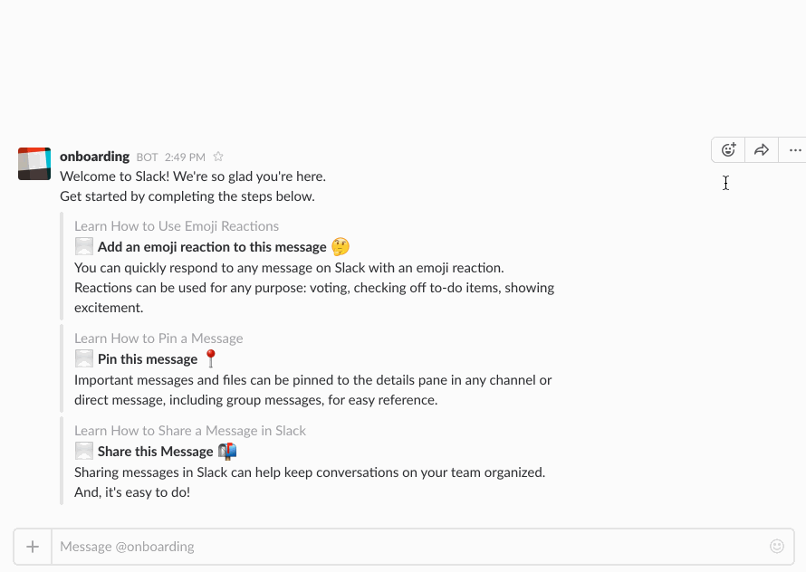

# Slack-Bot
Slack Chat Bot 

## Built With

- Code editor: VsCode
- Language: Ruby
- Linters: Rubocop
- Testing: RSpec

## Sample

## Live Demo

[Live Demo Link](https://repl.it/@happiguru/Slack-Bot#config.ru)

### Prerequisites

- Browser (Google Chrome, Mozilla Firefox, Safari or any other browser)
- Personal Slack Workspace
- Create a Slack App with "bot scope"
- Download and install [ngrok](https://ngrok.com/download) server 

### Setup

- Download or clone the repository's files [github repo](https://github.com/happiguru/Slack-Bot/tree/setup)
- Run `bundler install`
- Run `gem install bundle`
- Run `ngrok http 9292`

### App Permissions

- Ensure your newly created App has the following Permissions
1. message.im
2. pin_added
3. reaction_added
4. team_join

- run `rackup` from home directory contain the clone files
- run [https://yourwebname.ngrok.io/events] on web browser to give your app approval on Slack

### Tests

- Run `rspec` from within the project root directory

## Authors

👤 **Stanley Enow Lekunze**

- Github: [@happiguru](https://github.com/happiguru)
- Twitter: [@Lekunze_Nley](https://twitter.com/Lekunze_Nley)
- Linkedin: [lekunze-nley](https://www.linkedin.com/in/lekunze-nley/)

## 🤝 Contributing

Contributions, issues and feature requests are welcome!

Feel free to check the [issues page](https://github.com/happiguru/Slack-Bot/issues).

## Show your support

Give a ⭐️ if you like this project!

## Acknowledgments

- Microverse
- GitHub
- TheOdinProject
- Ruby

## 📝 License

This project is [MIT](lic.url) licensed.
